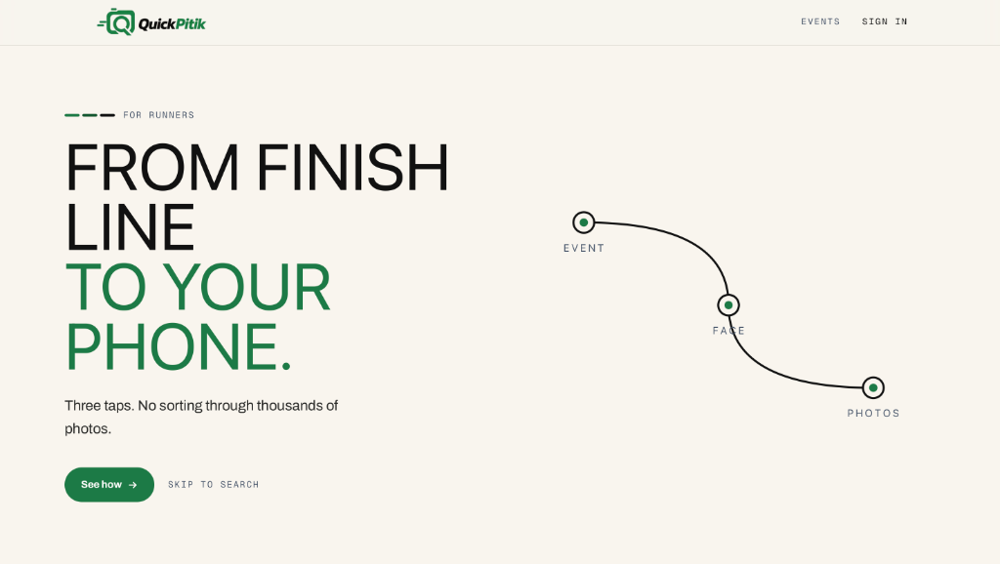
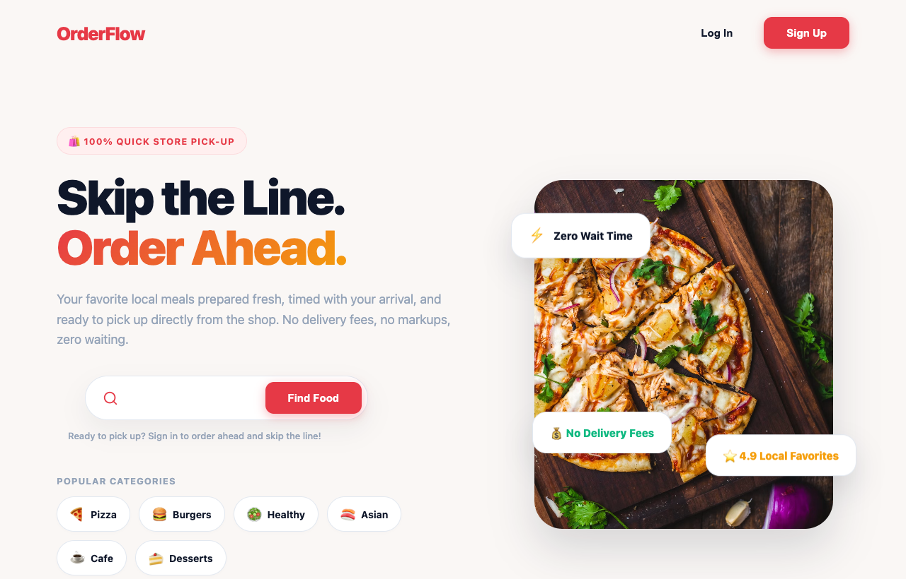
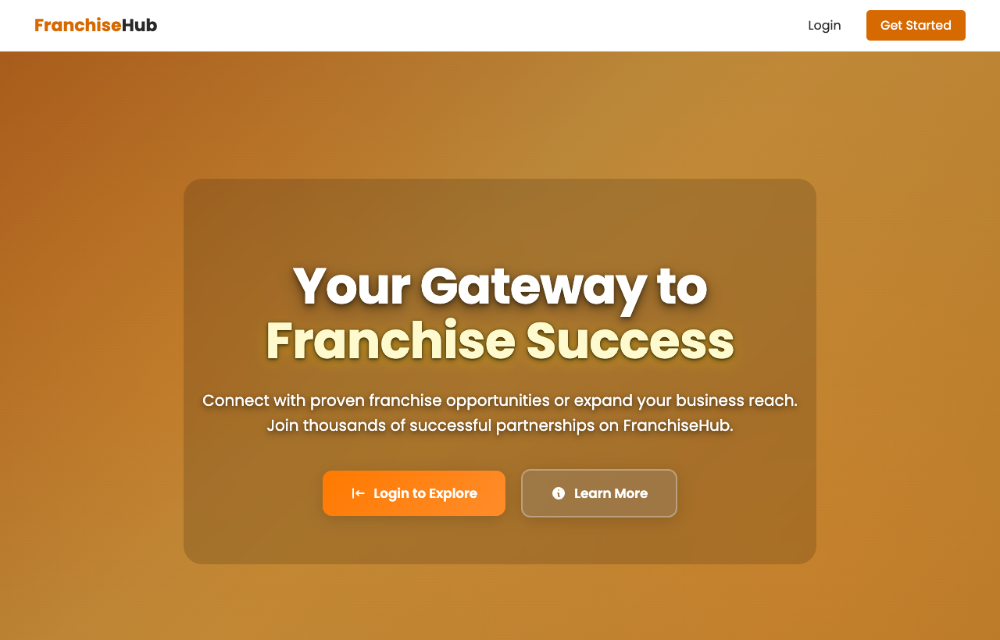
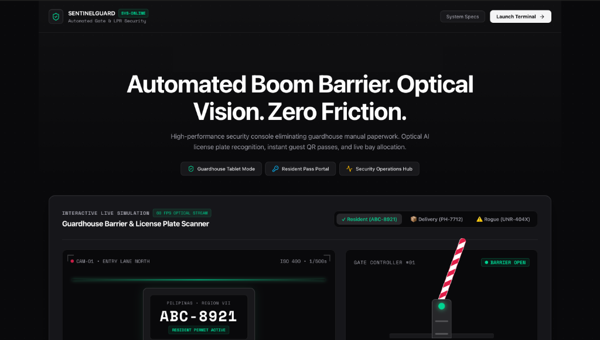
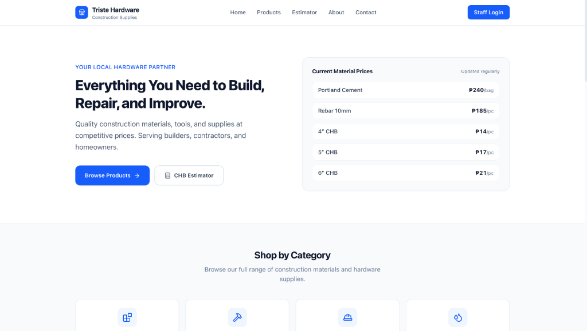

# Dillan Marquin Ycoy
**Full-Stack & Mobile Developer · Distributed Systems & Cloud Architecture**  
*4th-Year BSIT at Cebu Institute of Technology – University (CIT-U) · Cebu City, Philippines*

 

 

---

### 🚀 [Visit The Live Interactive Portfolio Website → ycoydillan.vercel.app](https://ycoydillan.vercel.app)

*Explore real-time distributed architecture simulators, an 8-bit retro arcade life story engine, live API telemetry streams, and production-tested systems engineering.*

---

 

## 🌟 Portfolio Website Showcase

The flagship portfolio at **[ycoydillan.vercel.app](https://ycoydillan.vercel.app)** is built as an interactive engineering console rather than a static resume:

* **Interactive Distributed Pipeline Simulators:** Inspect live data flows and simulated JSON payloads across microservices (OrderFlow kitchen queue, FranchiseHub KYC verification, and SentinelGuard boom barrier LPR recognition).
* **Playable 8-Bit Life Story:** An interactive canvas arcade minigame detailing my tech journey, CIT-U milestones, and engineering inspirations.
* **AI Digital Twin Assistant:** Embedded AI chatbot capable of answering technical and architectural questions about my projects and background.
* **Realtime Telemetry & Microservices Map:** Visual network topology tracing Spring Boot gateways, stateless FastAPI inference engines, and pgvector storage.

👉 **Launch and test the full experience at [ycoydillan.vercel.app](https://ycoydillan.vercel.app)**.

 

## 🛠️ Systems & Technical Architecture

### Core Polyglot Languages

### Distributed Backend & APIs

### Frontend & Native Mobile Clients

### Cloud, Data & AI Infrastructure

 

## 🔬 Featured Engineering Systems

### 1. [QuickPitik — Marathon Photography Cloud & AI Marketplace](https://quickpitik.com)
**Flagship Capstone Monorepo · 2026**  
[🌐 Live Website](https://quickpitik.com) · [Architecture Breakdown on Portfolio](https://ycoydillan.vercel.app/#projects)

* **Distributed Microservices:** Proxies traffic seamlessly between a Spring Boot gateway (session/payment orchestration), Next.js runner marketplace, and a stateless FastAPI computer vision engine.
* **Vector & AI Pipelines:** Sub-second athlete face & bib retrieval using PostgreSQL 16 + `pgvector` (Cosine Similarity) with RetinaFace, ArcFace embeddings, and PaddleOCR.
* **Mobile & DevOps:** Kotlin Jetpack Compose camera-to-cloud tethering app with real-time blur/sharpness culling; containerized with Docker Compose across AWS EC2, S3, and RDS.

---

### 2. [OrderFlow — Multi-Platform Restaurant Orchestration Engine](https://dillandeluxe.github.io/IT342-Ycoy-OrderFlow/)
**Full-Stack & Mobile Lead Developer**  
[🌐 Live Demo](https://dillandeluxe.github.io/IT342-Ycoy-OrderFlow/) · [💻 GitHub Repository](https://github.com/dillandeluxe/IT342-Ycoy-OrderFlow)

* **Unified REST Architecture:** Spring Boot REST backend concurrently powering an in-store React administrative dashboard and native Android dine-in table clients.
* **Realtime Kitchen Queue:** MySQL transactional ACID state transitions from customer order ingestion through kitchen prep and delivery fulfillment.
* **Automated Services:** Live calorie & macro calculation via Nutrients API with automated JavaMailSender customer receipts.

---

### 3. [FranchiseHub — B2B Regional Franchise Platform](https://franchisehub-t4nh.onrender.com)
**Lead Backend Developer**  
[🌐 Live Website](https://franchisehub-t4nh.onrender.com) · [💻 GitHub Repository](https://github.com/dillandeluxe/CSIT327-G5-FranchiseHub)

* **Domain & Qualification Engine:** Django application logic connecting prospective franchisees with franchisors across regional markets with automated KYC rules.
* **Database & Media Infrastructure:** Supabase PostgreSQL connection pooling via PgBouncer for high-concurrency investor intake, coupled with Cloudinary asset validation pipelines.

---

### 4. [SentinelGuard — Smart Residence LPR & Barrier Security PWA](https://dillandeluxe.github.io/SentinelGuard/)
**Systems & Frontend Developer**  
[🌐 Live Demo](https://dillandeluxe.github.io/SentinelGuard/) · [💻 GitHub Repository](https://github.com/dillandeluxe/SentinelGuard)

* **Intelligent Barrier Automation:** Smart Residence & Parking System PWA utilizing optical AI license plate recognition (LPR) for automated guardhouse boom barrier triggering.
* **Defensive Engineering:** Strict TypeScript defensive assertion boundaries, dynamic parking bay allocation, guardhouse QR passes, and zero-dependency compile-time type safety.

---

### 5. [Triste Hardware & Supplies — Commercial ERP & Piece-Rate POS](https://triste-hardware-inventory.vercel.app)
**Freelance Full-Stack Developer · Commercial Client**  
[🌐 Live Website](https://triste-hardware-inventory.vercel.app)

* **Next.js 15 App Router:** Production ERP & Point-of-Sale platform featuring live inventory decrement and optimistic client-side updates.
* **Custom Payroll Engine:** Automated masonry piece-rate calculation with configurable 4"/5"/6" concrete hollow block (CHB) rates and cash advance (*bali*) deductions.
* **Cloud Security:** PostgreSQL with Supabase Row-Level Security (RLS) enforcing multi-tiered role isolation.

 

## 🎓 Academic Foundation

* **Degree:** Bachelor of Science in Information Technology (BSIT)
* **Institution:** Cebu Institute of Technology – University (CIT-U), Cebu City, Philippines
* **Standing:** 4th-Year Standing (Expected Graduation: 2027)
* **Specialization:** Distributed Backends, Microservices, Relational & Vector Databases, Native Android, and Computer Vision.

 

## 📬 Contact & Links

* 🌐 **Portfolio Website:** [ycoydillan.vercel.app](https://ycoydillan.vercel.app)
* 💼 **LinkedIn Profile:** [linkedin.com/in/dillan-ycoy-158661441](https://www.linkedin.com/in/dillan-ycoy-158661441/)
* 🐙 **GitHub Profile:** [github.com/dillandeluxe](https://github.com/dillandeluxe)
* ✉️ **Email:** [ycoydillan@gmail.com](mailto:ycoydillan@gmail.com)
* 📍 **Location:** Cebu City, Philippines